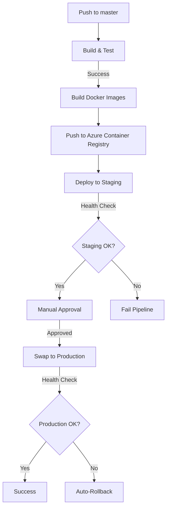

## CI/CD Pipeline & Monitoring Documentation

### Pipeline Overview



### Pipeline Steps

1. **Build & Test**
   - Restore NuGet packages
   - Build solution
   - Run unit & integration tests
   - Publish test results

2. **Container Build**
   - Build Docker images for all services:
     - `station`: Weather station simulator
     - `localnode`: Local aggregation node
     - `central`: Blazor UI & central aggregation

3. **Staging Deployment**
   - Push images to Azure Container Registry
   - Deploy to staging environment
   - Run health checks
   - Manual approval required

4. **Production Deployment**
   - Create backup slot
   - Swap staging ? production
   - Monitor health
   - Auto-rollback on failure

### Rollback Strategy

1. **Automatic Rollback Triggers**
   - Failed health checks
   - High error rate
   - Service unavailability

2. **Rollback Process**
   - Maintain backup slot
   - Instant slot swap back
   - Notify team

### Monitoring & Logging

1. **Application Metrics**
   - Prometheus counters for measurements
   - OpenTelemetry for traces
   - Health check endpoints

2. **Infrastructure**
   - Azure Application Insights
   - Container metrics
   - Network connectivity

### Required Secrets

```yaml
AZURE_CREDENTIALS: Service principal for Azure
ACR_LOGIN_SERVER: Container registry URL
ACR_USERNAME: Registry username
ACR_PASSWORD: Registry password
ACR_NAME: Registry name
```

### Health Checks

- `/health`: Overall application health
- `/metrics`: Prometheus metrics
- Custom sensor statistics

### Local Development

```powershell
# Start local environment
.\scripts\start-dev.ps1 -Stations 3

# Stop local environment
.\scripts\stop-dev.ps1
```